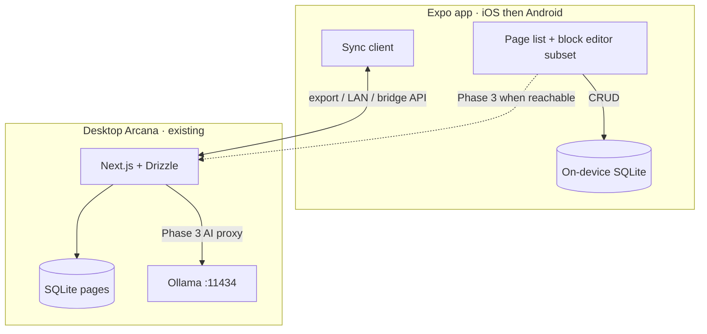

# Plan for App (Mobile)

Post-MVP strategy for shipping Arcana on phones. Desktop remains the primary local-AI machine; mobile is notes-first with sync, then optional AI.

| Decision | Choice |
| --- | --- |
| Platforms | **iOS first** (TestFlight), then Android from the same codebase |
| Stack | **Expo (React Native)** |
| Not chosen | Capacitor wrapping the existing Next.js app |
| Product split | Phone = pages + editor + sync; heavy LLM stays on desktop Ollama until Phase 3 |

Related: [docs/ARCHITECTURE.md](./docs/ARCHITECTURE.md) · [docs/MVP_ROADMAP.md](./docs/MVP_ROADMAP.md) · [README.md](./README.md)

---

## Why not wrap the web app

Today Arcana is a **same-machine** stack:

- Next.js App Router on localhost
- SQLite via Drizzle (`data/arcana.db` or desktop Application Support)
- Ollama on `127.0.0.1:11434`
- Optional **Tauri** macOS shell that sidecars the Next server

Phones cannot run that sidecar model as-is: no durable Node + Ollama pair on-device for the MVP thesis, and App Store distribution cannot depend on “install Ollama on the phone.” Wrapping the Next UI in Capacitor would still leave persistence and AI bound to a desktop localhost process the phone cannot reach in daily use.

**Expo** gives a real native shell, on-device SQLite, TestFlight/App Store paths, and a shared TypeScript app for iOS and Android without reusing the Next server as the phone runtime.

---

## Target architecture



**v1 mental model:** the phone owns a copy of pages; desktop remains system of record for free local AI until a sync + proxy path exists.

---

## Reuse from this repo

Keep mobile data and APIs aligned with what already ships:

| Area | Source | Mobile use |
| --- | --- | --- |
| Page model | [`src/db/schema.ts`](./src/db/schema.ts) | Same fields: `id`, `title`, `parentId`, `content` (JSON string), `createdAt`, `updatedAt` |
| Pages CRUD | [`src/app/api/pages`](./src/app/api/pages) | Shape sync payloads / bridge API after Phase 1 |
| AI contracts | [`src/app/api/ai/route.ts`](./src/app/api/ai/route.ts) | Same actions: `summarize`, `rewrite`, `ask`, `bullets`, `checklist` — call desktop when online in Phase 3 |
| UX layout | Architecture “sidebar / canvas / AI panel” | Collapse to list → editor → AI sheet on small screens |

`content` stays BlockNote-compatible JSON where possible so a page edited on phone can round-trip to desktop without a second document format. Phase 1 may support a **subset** of blocks (paragraph, heading, bullet, numbered, checklist, code) and reject or flatten unsupported types on sync.

---

## Phased roadmap

### Phase 0 — Constraints

- Local-first: notes work offline on the device.
- No App Store dependency on bundling or requiring Ollama on the phone.
- Desktop Arcana + Ollama remain the free-AI home.
- Document privacy posture: on-device DB; sync only to user-controlled desktop/LAN unless a later cloud option is explicitly added.

### Phase 1 — Expo notes MVP

- Scaffold Expo app (TypeScript, file-based routes or a simple nav stack).
- On-device SQLite matching the `pages` schema.
- Page list: create, rename, delete, nest under `parentId`.
- Editor: subset of blocks above; debounced save like the web app.
- No AI required for Phase 1 definition of done.

**Done when:** create/edit/reopen pages on a physical iPhone or Simulator; data survives app restart.

### Phase 2 — Sync with desktop

Pick one bridge and ship it end-to-end (prefer simplest first):

1. **Export / import** — JSON or SQLite dump share sheet ↔ desktop import (lowest infra).
2. **LAN bridge** — desktop Next exposes a sync endpoint; phone discovers Mac on same Wi‑Fi (or manual URL).
3. **Later** — Git/WebDAV-style sync already sketched under Architecture “Future extensions.”

Conflict rule for v1: last-write-wins on `updatedAt`, with a clear “synced / conflict” affordance — no CRDT yet.

**Done when:** a page created on phone appears in desktop Arcana (and vice versa) via the chosen path.

### Phase 3 — AI on phone

- When desktop bridge is reachable, proxy the existing `/api/ai` streaming contract (same action set).
- When unreachable, show the same class of clear error the web app shows when Ollama is down — never silent failure.
- Optional later: paid/cloud model toggle — **not** the default; keep “free local AI” desktop-primary.

**Done when:** all five AI actions work from the phone against a running desktop Ollama via the bridge.

### Phase 4 — Distribution

- App icons, splash, bundle IDs (`com.arcana.mobile` or similar).
- TestFlight internal build; then App Store listing + privacy nutrition labels (on-device data; no tracking in v1).
- Android Play track from the same Expo project after iOS is stable.
- EAS Build / submit in CI as follow-up, not a Phase 1 blocker.

**Done when:** TestFlight build installable by the team; store metadata drafted.

---

## Out of scope for v1

- Full BlockNote feature parity (slash menus, advanced embeds, databases)
- Multiplayer / realtime CRDT
- App Store–bundled LLM or requiring Ollama on iOS
- Replacing the Tauri macOS desktop shell
- Auth, teams, cloud-hosted Arcana as the primary backend

---

## Suggested repo layout (when implementation starts)

```text
apps/
  mobile/          # Expo app (new)
src/               # existing Next.js web + API (unchanged as source of truth for desktop)
src-tauri/         # existing macOS shell
Plan for app.md    # this document
```

Monorepo tooling (npm workspaces / Turborepo) can wait until the Expo app exists; do not block Phase 1 on a perfect monorepo.

---

## Success criteria (overall)

| Criterion | Measure |
| --- | --- |
| Notes on the go | Offline page CRUD on iPhone |
| Local-first intact | No mandatory cloud AI or cloud DB for core notes |
| Desktop AI preserved | Free Ollama path remains on Mac; phone uses it via bridge in Phase 3 |
| Ship path | TestFlight before any store marketing |

---

## One-liner

> **Expo owns on-device pages → sync bridges to desktop SQLite → Ollama stays on the Mac until the phone can reach it.**
