# Arcana Architecture

Local-first, Notion-like notes with free AI via [Ollama](https://ollama.com). All data and inference stay on your machine.

| Companion | Where |
| --- | --- |
| Interactive canvas | [arcana-architecture.canvas.tsx](./canvases/arcana-architecture.canvas.tsx) · also in Cursor canvases |
| Notion study | [notion-architecture.md](./notion-architecture.md) |
| Build checklist | [MVP_ROADMAP.md](./MVP_ROADMAP.md) |

---

## At a glance

| | | | |
|:---:|:---:|:---:|:---:|
| **1 machine** | **SQLite** | **Ollama** | **5 AI actions** |
| No cloud required | System of record | Local LLM | Summarize → checklist |
| | | | |

> **Thesis:** Arcana is a thin Next.js shell around a block editor and a local model. Boring persistence first; CRDT / multiplayer later.

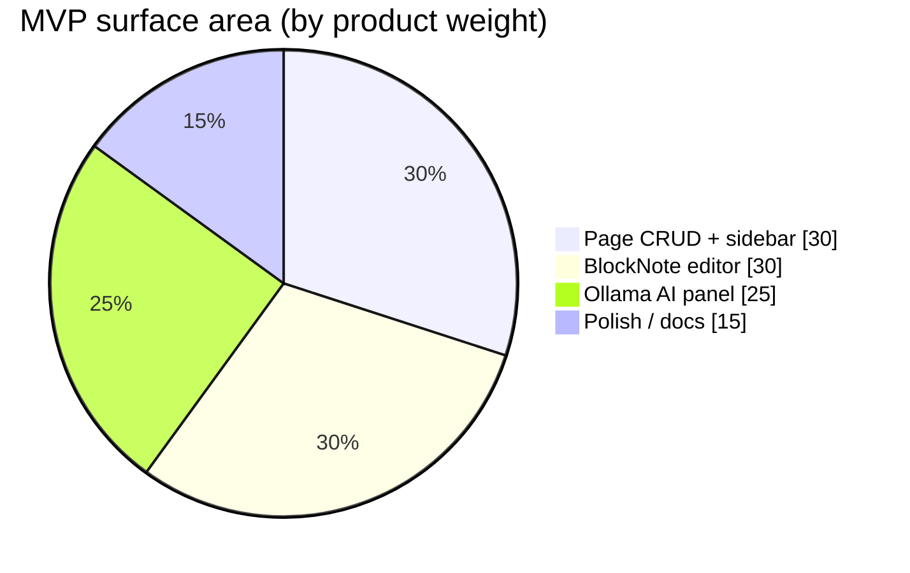

---

## Goals vs non-goals

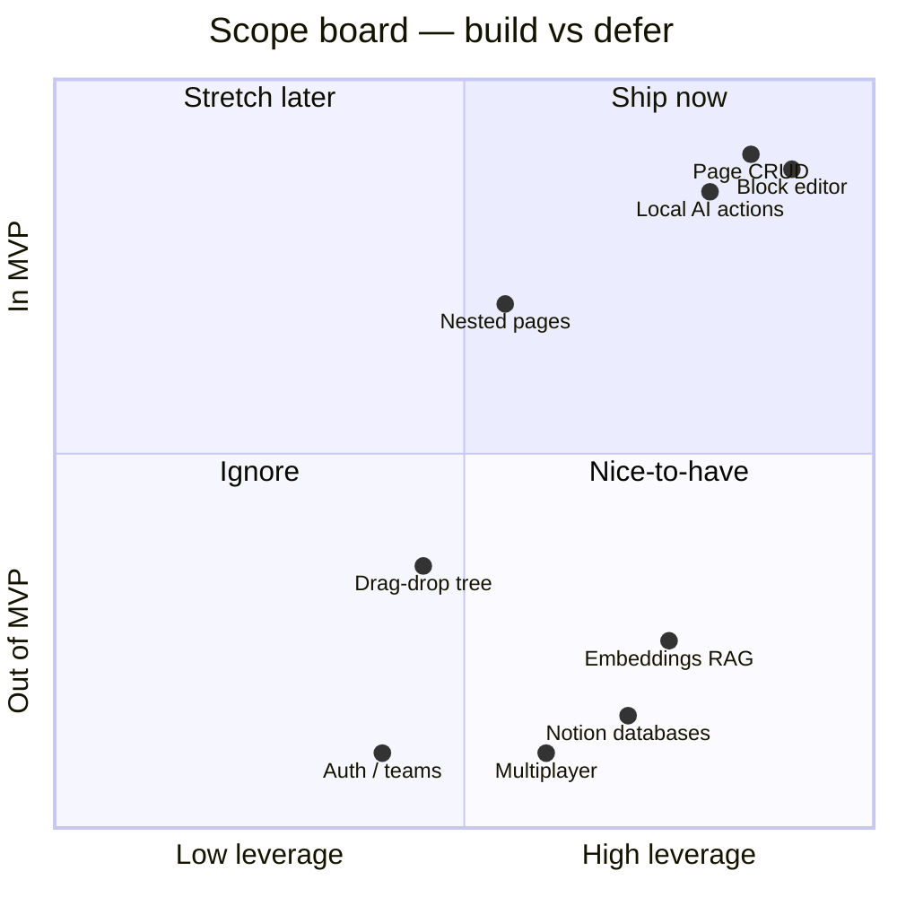

| In MVP | Explicitly out |
| --- | --- |
| Own notes + AI stack (no Notion AI bill) | Databases, kanban, calendars, formulas |
| Pages, nesting, block editor | Multiplayer / realtime / cloud host |
| Summarize, rewrite, ask, bullets, checklist | Auth, teams, permissions, sharing |
| Next.js + SQLite + Ollama on localhost | Mobile apps, plugin marketplace |
| | Cross-page RAG (see [Future](#future-extensions)) |

---

## System map

Hot path = typing and save. AI path is assistive and never blocks the editor.

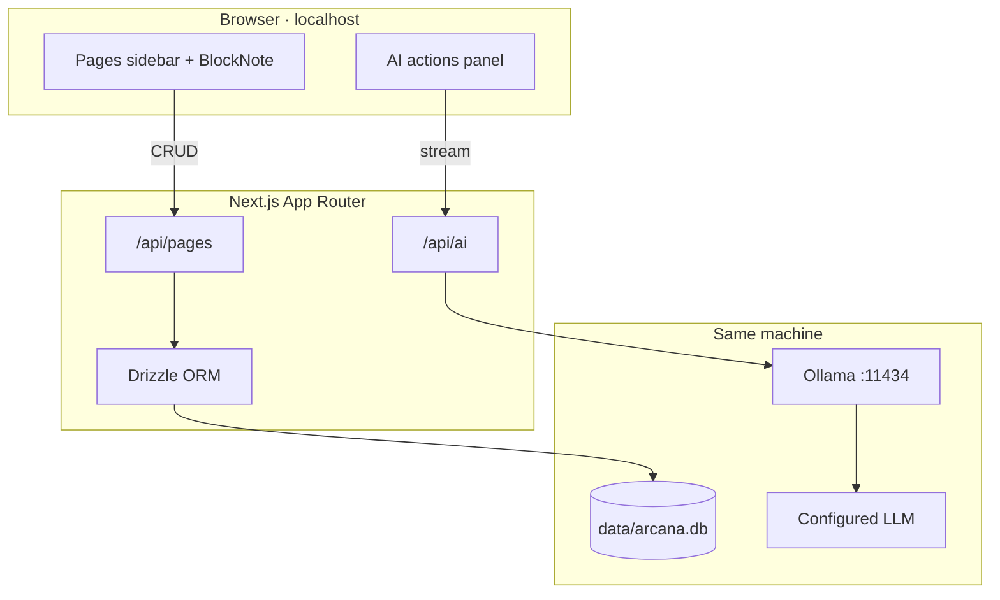

### Spatial UX (designer lens)

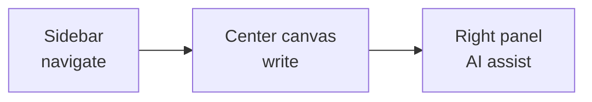

| Region | Job | Rule |
| --- | --- | --- |
| Left sidebar | Orient & open pages | Never run inference here |
| Center | Create & read | Typing never waits on Ollama |
| Right AI panel | Assistive transforms | Explicit insert only — no silent overwrite |

---

## Request flows

### A — Edit a page

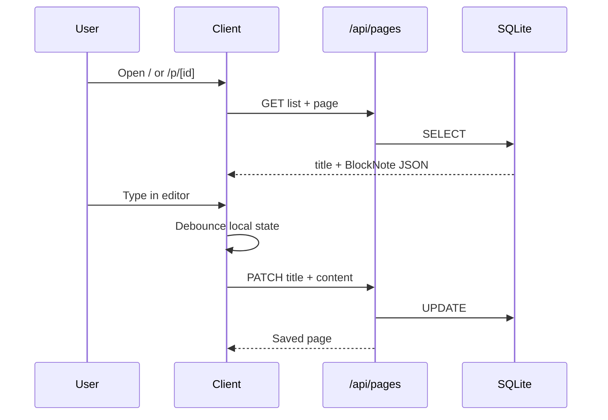

### B — AI action

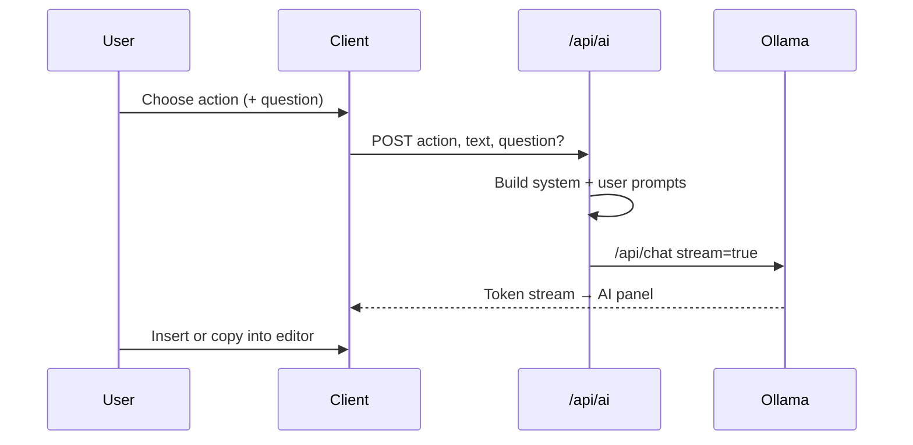

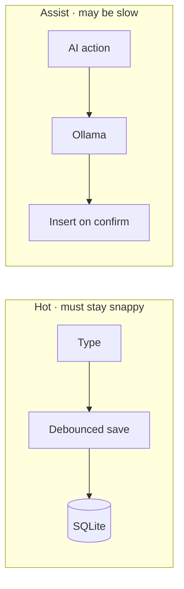

---

## Tech stack

| Layer | Choice | Why |
| --- | --- | --- |
| App | Next.js App Router + TypeScript | One local codebase: UI + API |
| Styling | Tailwind CSS | Fast layout, no design-system tax |
| Editor | BlockNote | Notion-like blocks out of the box |
| DB | SQLite + Drizzle | Zero ops, file on disk, typed schema |
| AI | Ollama HTTP API | Free, local, model-swappable |
| Default model | `qwen2.5:7b` | Strong writing / instruction following |
| Fallback | `llama3.2:3b` | Lighter machines / faster replies |

### Model menu

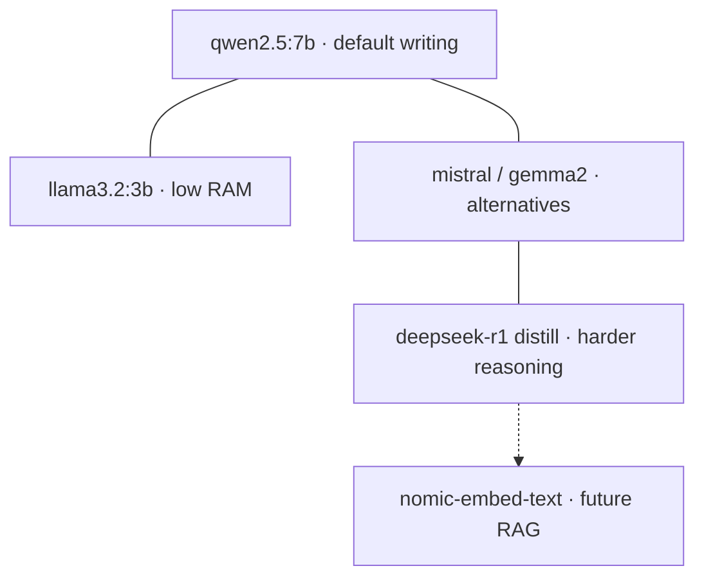

| Model | Pull | Best for |
| --- | --- | --- |
| Qwen 2.5 7B | `ollama pull qwen2.5:7b` | Default writing, summarize, rewrite |
| Llama 3.2 3B | `ollama pull llama3.2:3b` | Low RAM / faster |
| Mistral | `ollama pull mistral` | General chat / rewrite |
| Gemma 2 9B | `ollama pull gemma2:9b` | Quality / speed tradeoff |
| Phi-3 / Phi-4 | `ollama pull phi3` | Small / fast on laptops |
| DeepSeek-R1 distill | `ollama pull deepseek-r1:8b` | Harder reasoning (slower) |
| nomic-embed-text | `ollama pull nomic-embed-text` | Future embeddings (not MVP) |

Arcana reads `OLLAMA_BASE_URL` and `OLLAMA_MODEL`. Switching models is an Ollama concern.

---

## Data model

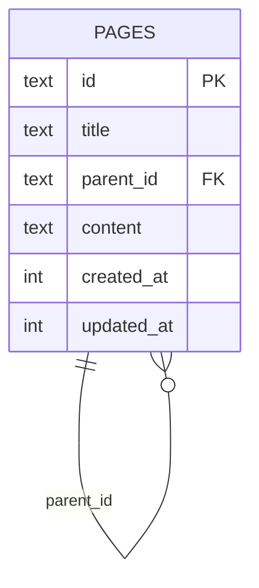

| Column | Type | Notes |
| --- | --- | --- |
| `id` | text PK | UUID |
| `title` | text | Default `"Untitled"` |
| `parent_id` | text nullable | Self-FK for nesting |
| `content` | text | BlockNote JSON (stringified) |
| `created_at` | integer | Unix ms |
| `updated_at` | integer | Unix ms |

**Nesting (MVP):** `parent_id` powers a simple sidebar tree. Drag-and-drop reparenting can come later.

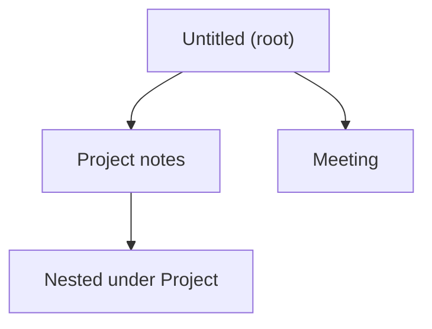

---

## API contracts

### Pages

| Method | Path | Body / params | Response |
| --- | --- | --- | --- |
| `GET` | `/api/pages` | — | `{ pages: Page[] }` |
| `POST` | `/api/pages` | `{ title?, parentId? }` | `{ page: Page }` |
| `GET` | `/api/pages/[id]` | — | `{ page: Page }` |
| `PATCH` | `/api/pages/[id]` | `{ title?, content?, parentId? }` | `{ page: Page }` |
| `DELETE` | `/api/pages/[id]` | — | `{ ok: true }` |

```ts
type Page = {
  id: string;
  title: string;
  parentId: string | null;
  content: string; // BlockNote JSON
  createdAt: number;
  updatedAt: number;
};
```

Delete with children: reparent children to root (`parent_id = null`).

### AI

| Method | Path | Body | Response |
| --- | --- | --- | --- |
| `POST` | `/api/ai` | `{ action, text, question? }` | text / NDJSON stream |

```ts
type AiAction =
  | "summarize"
  | "rewrite"
  | "ask"
  | "bullets"
  | "checklist";

type AiRequest = {
  action: AiAction;
  text: string;
  question?: string; // required when action === "ask"
};
```

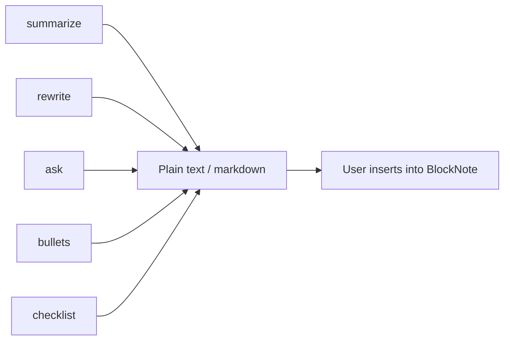

| Status | When |
| --- | --- |
| `400` | Missing text / missing question / unknown action |
| `502` / `503` | Ollama down or model missing — tell user to `ollama serve` / `pull` |

---

## AI prompt contracts

| Action | Instruction |
| --- | --- |
| `summarize` | Concise summary; preserve key facts |
| `rewrite` | Clearer, tighter prose; same meaning; no new facts |
| `ask` | Answer using **only** page text; say if unknown |
| `bullets` | Markdown bullet list |
| `checklist` | Markdown `- [ ]` items |

Models never see secrets beyond page text. Output is paste-ready for BlockNote.

---

## Ollama integration

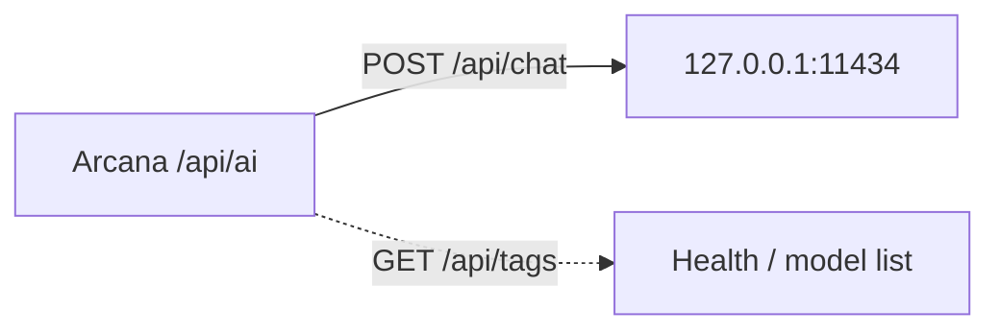

```bash
OLLAMA_BASE_URL=http://127.0.0.1:11434
OLLAMA_MODEL=qwen2.5:7b
DATABASE_URL=file:./data/arcana.db
```

---

## App structure

```
arcana/
├── README.md
├── docs/
│   ├── ARCHITECTURE.md      ← you are here
│   ├── MVP_ROADMAP.md
│   ├── notion-architecture.md
│   └── canvases/            ← Cursor canvas sources (versioned)
├── data/                    # SQLite (gitignored)
├── drizzle/
├── src/
│   ├── app/
│   │   ├── page.tsx                 # workspace
│   │   ├── p/[id]/page.tsx         # editor
│   │   └── api/{pages,ai}/…
│   ├── components/{sidebar,editor,ai-panel}.tsx
│   ├── db/{index,schema}.ts
│   └── lib/{ollama,prompts}.ts
└── …
```

---

## Security & privacy

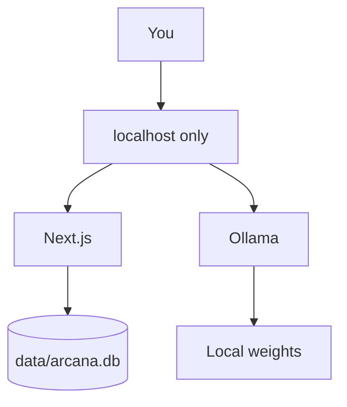

- Bind to localhost; do not expose Next.js or Ollama publicly without hardening.
- No cloud AI keys in MVP.
- Back up notes by copying `data/arcana.db` (browser/dev) or `~/Library/Application Support/com.arcana.desktop/arcana.db` (desktop).

---

## Desktop shell (macOS)

Tauri wraps the same Next.js app. Release builds embed a Node binary + `output: "standalone"` server as resources; the Rust side spawns that sidecar on `127.0.0.1:47821`, waits for the port, then navigates the webview. Dev mode uses `beforeDevCommand` → `npm run dev` and loads `http://127.0.0.1:3000` (no sidecar).

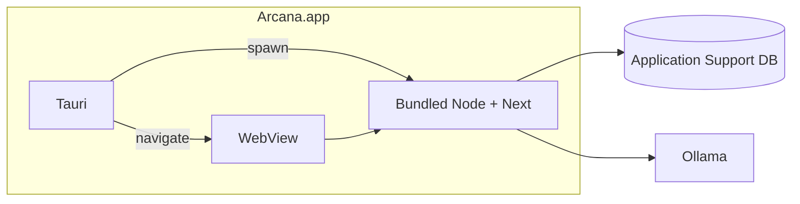

See README **Desktop (macOS)** for build commands.

---

## Future extensions

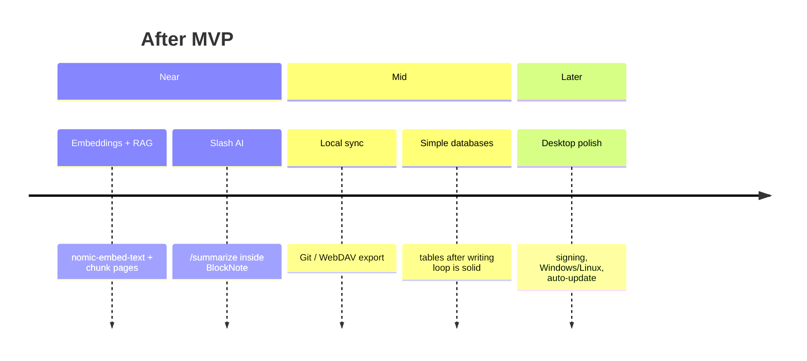

1. **Embeddings + RAG** — ask across the workspace  
2. **Slash-command AI** — `/summarize` in-editor  
3. **Sync** — Git-backed or WebDAV; still local-first  
4. **Databases** — simple tables  
5. **Desktop polish** — notarization, other OS targets (macOS shell shipped)  

---

## Design principles

| Principle | Meaning |
| --- | --- |
| One job per surface | Sidebar = navigate · Center = write · Panel = AI |
| Boring persistence | SQLite JSON before CRDT |
| AI is assistive | Never auto-overwrite without explicit insert |
| Fail loudly | Clear error when Ollama is down — never silent |

---

## One-liner

> **Browser holds BlockNote → Next.js persists to SQLite → Ollama streams assistive text → user chooses what lands in the page.**
