# Arcana MVP Roadmap

Execution checklist for the first usable Arcana. Architecture: [ARCHITECTURE.md](./ARCHITECTURE.md).

| Companion | Where |
| --- | --- |
| Interactive canvas | [mvp-roadmap](./canvases/mvp-roadmap.canvas.tsx) (also in Cursor canvases) |
| System design | [ARCHITECTURE.md](./ARCHITECTURE.md) |

---

## At a glance

| | | | |
|:---:|:---:|:---:|:---:|
| **5 phases** | **All complete** | **0 paid keys** | **Local only** |
| 0 → Docs … 4 → Polish | MVP definition of done | No cloud AI bill | SQLite + Ollama |

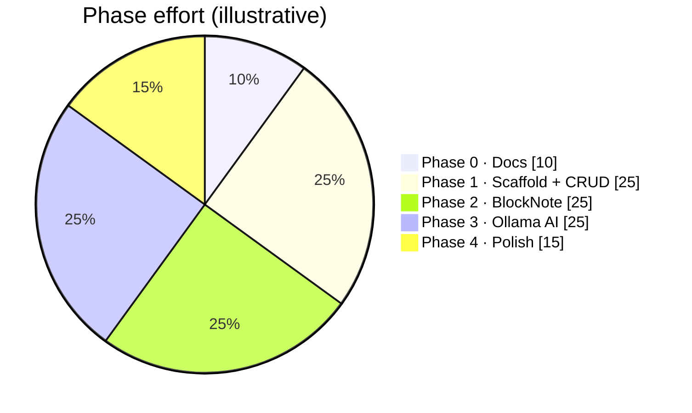

---

## Definition of done (MVP)

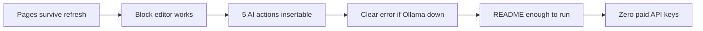

- [x] Create / rename / delete pages; content survives refresh
- [x] Block editor: text, headings, bullets, numbered lists, checklists, code
- [x] With Ollama + model pulled, all five AI actions work; results insertable
- [x] Clear error when Ollama is down or model is missing
- [x] README alone is enough to install and run locally
- [x] Zero paid API keys

> AI needs Ollama locally (`ollama serve` + `ollama pull <model>`). Without it, the AI panel shows a connection error.

---

## Roadmap timeline

```mermaid
gantt
  title Arcana MVP delivery (logical order)
  dateFormat  X
  axisFormat  %s

  section Phase 0
  Architecture + README           :done, p0, 0, 1

  section Phase 1
  Next.js + Drizzle + SQLite      :done, p1a, 1, 2
  Pages API + sidebar CRUD        :done, p1b, 2, 3

  section Phase 2
  BlockNote + debounced save      :done, p2, 3, 4

  section Phase 3
  Ollama client + prompts + /api/ai :done, p3a, 4, 5
  AI panel + insert                 :done, p3b, 5, 6

  section Phase 4
  Errors, streaming, polish       :done, p4, 6, 7
```

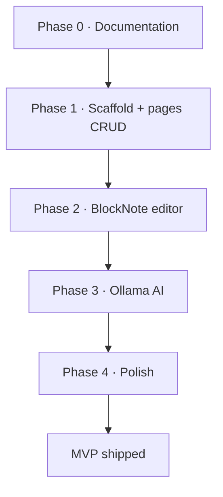

---

## Phase 0 — Documentation

**Status:** complete

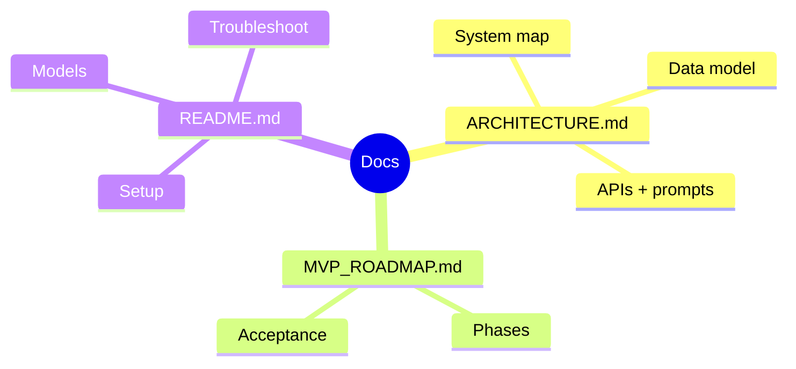

- [x] `docs/ARCHITECTURE.md` — system map, data model, APIs, prompts, Ollama, non-goals
- [x] `docs/MVP_ROADMAP.md` — this file
- [x] `README.md` — product, setup, models, structure, troubleshooting

**Acceptance:** A newcomer understands what Arcana is, what is in/out of MVP, and how pieces connect.

---

## Phase 1 — Scaffold + pages CRUD

**Status:** complete

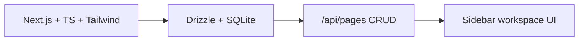

- [x] Next.js App Router + TypeScript + Tailwind
- [x] Drizzle + SQLite (`data/arcana.db`), `pages` table, migrations
- [x] `.env.example` with `DATABASE_URL`, `OLLAMA_BASE_URL`, `OLLAMA_MODEL`
- [x] API: `GET/POST /api/pages`, `GET/PATCH/DELETE /api/pages/[id]`
- [x] Workspace UI: sidebar list, create, open, rename, delete
- [x] Empty state when no pages exist

**Acceptance:** Create three pages, rename one, delete one, refresh — list matches DB.

---

## Phase 2 — BlockNote editor

**Status:** complete

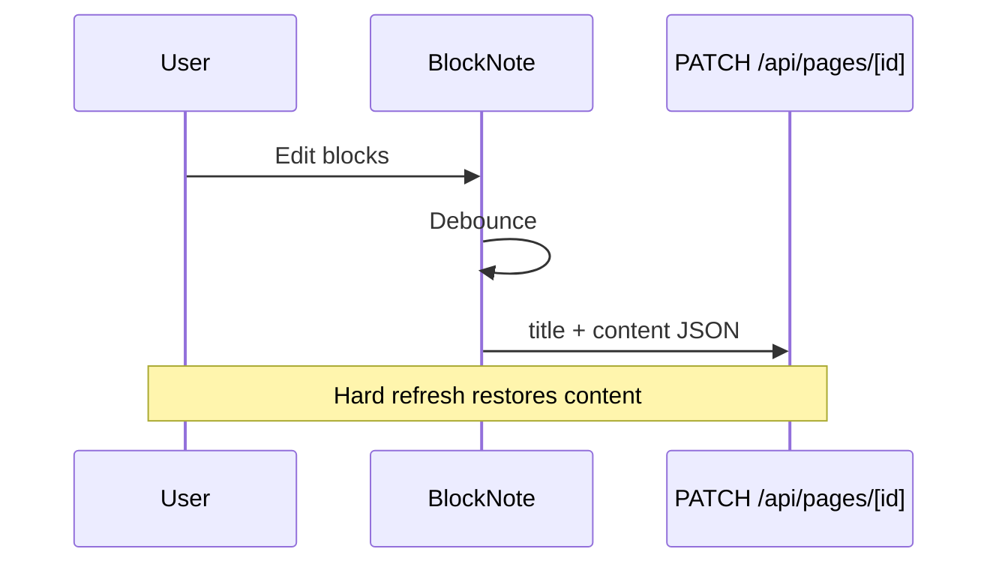

- [x] Editor loads `page.content`
- [x] Debounced save on change
- [x] Blocks: paragraph, heading, bullet, numbered, checklist, code
- [x] Route `/p/[id]` for focused editing

**Acceptance:** Type content, wait for save, hard refresh — content restored.

---

## Phase 3 — Ollama AI

**Status:** complete

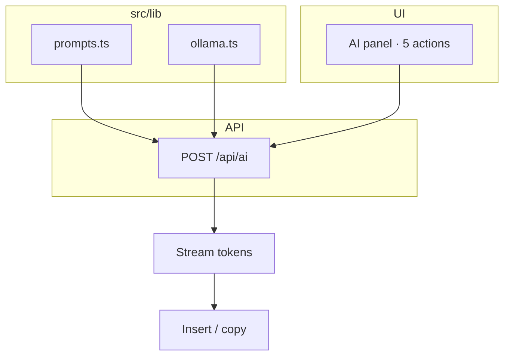

| Action | Outcome |
| --- | --- |
| Summarize | Concise note summary |
| Rewrite | Clearer prose |
| Ask | Answer from page text only |
| Bullets | Markdown list |
| Checklist | `- [ ]` items |

- [x] `src/lib/ollama.ts` — chat helper + stream
- [x] `src/lib/prompts.ts` — action → messages
- [x] `POST /api/ai` — streaming response
- [x] AI panel UI for all five actions
- [x] Insert result into editor (or copy)
- [x] Plain text from page via BlockNote markdown extract

**Acceptance:** Each action returns usable text against a sample note with Ollama up.

---

## Phase 4 — Polish

**Status:** complete

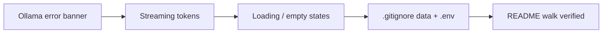

- [x] Error banner when Ollama unreachable / model missing
- [x] Streaming tokens in AI panel
- [x] Loading / empty states for sidebar and editor
- [x] `.gitignore` for `data/`, `.env`, `node_modules`
- [x] Walk README install path end-to-end (`db:push`, `dev`, pages API)

**Acceptance:** MVP definition of done checked above.

---

## Progress snapshot

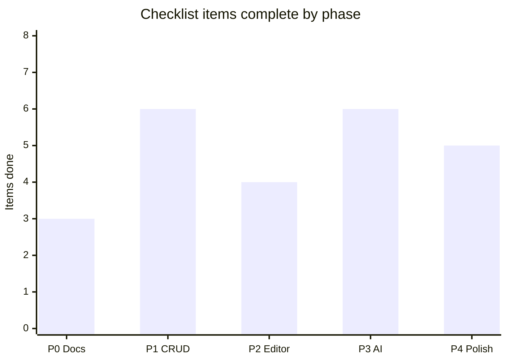

| Phase | Items | Status |
| --- | ---: | --- |
| 0 · Documentation | 3 | Done |
| 1 · Scaffold + CRUD | 6 | Done |
| 2 · BlockNote | 4 | Done |
| 3 · Ollama AI | 6 | Done |
| 4 · Polish | 5 | Done |
| **Total** | **24** | **MVP complete** |

---

## Explicitly deferred

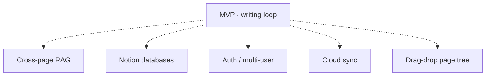

| Item | Why deferred |
| --- | --- |
| Cross-page RAG | Needs embeddings + chunking |
| Notion databases | Large scope; writing loop first |
| Auth / multi-user | Personal local tool |
| Cloud sync | Local-first MVP |
| Drag-drop page tree | Nice-to-have after CRUD |

---

## Suggested order of work (replay)

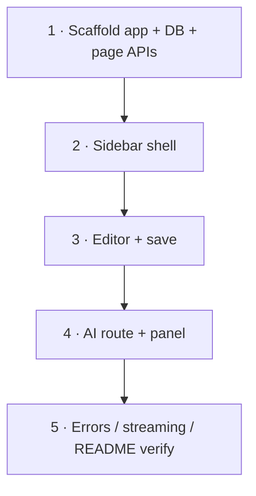

1. Scaffold app + DB + page APIs  
2. Sidebar shell  
3. Editor + save  
4. AI route + panel  
5. Errors / streaming / README verify  

---

## One-liner

> **Docs → CRUD → Editor → Local AI → Polish.** Everything else waits until the writing loop feels boringly reliable.
