# Notion — System Architecture

> A designer + senior-engineer walkthrough of how Notion is structured: product model, client, sync, services, data, and UX. Based on public engineering talks, blogs, and observed product behavior — not internal Notion source.

| Companion | Where |
| --- | --- |
| Interactive canvas (open beside chat) | Cursor: `canvases/notion-architecture.canvas.tsx` |
| Versioned copy in this repo | [canvases/notion-architecture.canvas.tsx](./canvases/notion-architecture.canvas.tsx) |
| Arcana (what we build) | [ARCHITECTURE.md](./ARCHITECTURE.md) |

---

## At a glance

| | | | |
|:---:|:---:|:---:|:---:|
| **1 tree** | **~16ms** | **space_id** | **ACL** |
| Universal block model | Typing budget (local) | Primary shard key | Wraps every fetch |

> **Thesis:** Notion is not docs-with-databases. It is a recursive block canvas where pages, rows, views, and AI are different projectors over the same permissioned tree.

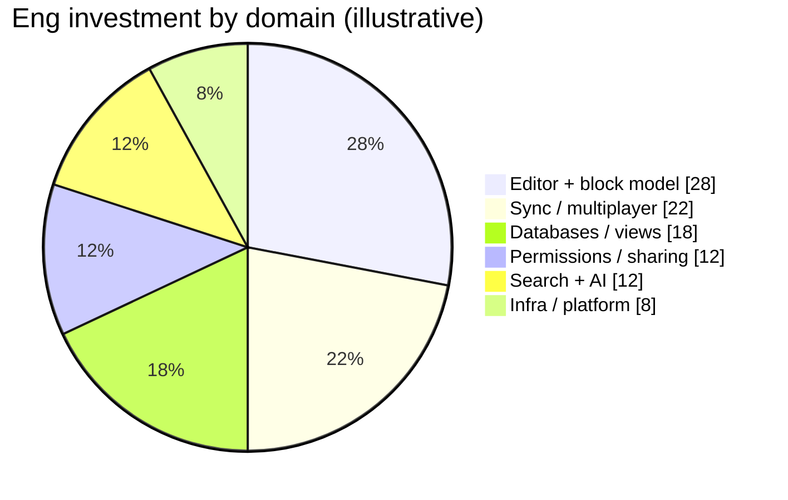

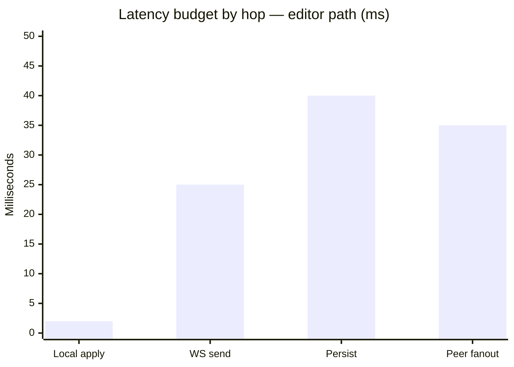

---

## 1. Product thesis (why the architecture looks like this)

Notion is not a doc editor with databases bolted on. It is a **universal block canvas** where pages, databases, embeds, and AI are the same substrate with different renderers and permissions.

Three non-negotiables drive every layer:

| Principle | Product consequence | Engineering consequence |
| --- | --- | --- |
| Everything is a block | One mental model for users | One recursive tree + typed properties |
| Instant & multiplayer | Optimistic UI, presence, live cursors | CRDT/OT-style sync + WebSockets |
| Nested workspaces | Share a page, not a file | Permission inheritance down the page tree |

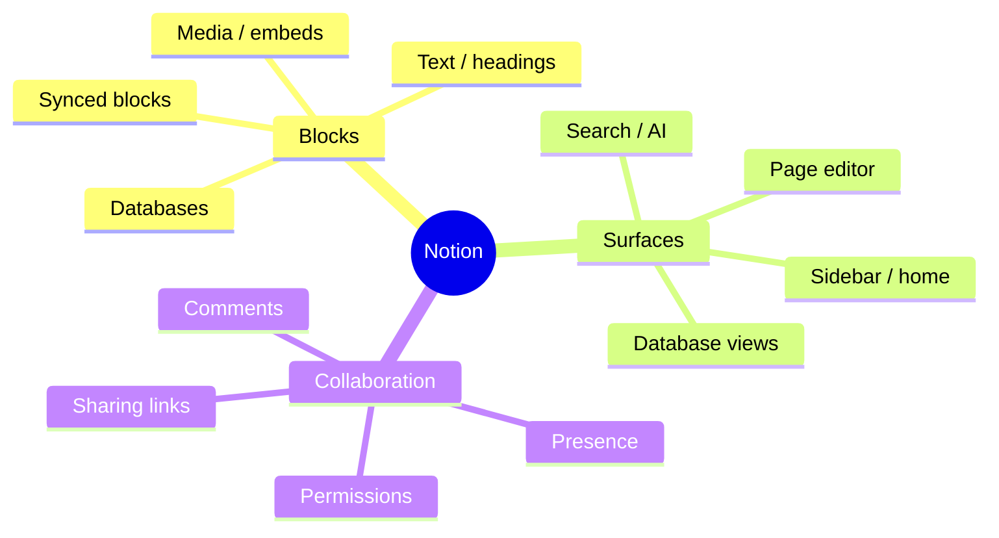

---

## 2. Mental model: the block tree

Every page is a tree of **blocks**. A database row is a page. A page can contain databases. Views are filtered projections over the same rows.

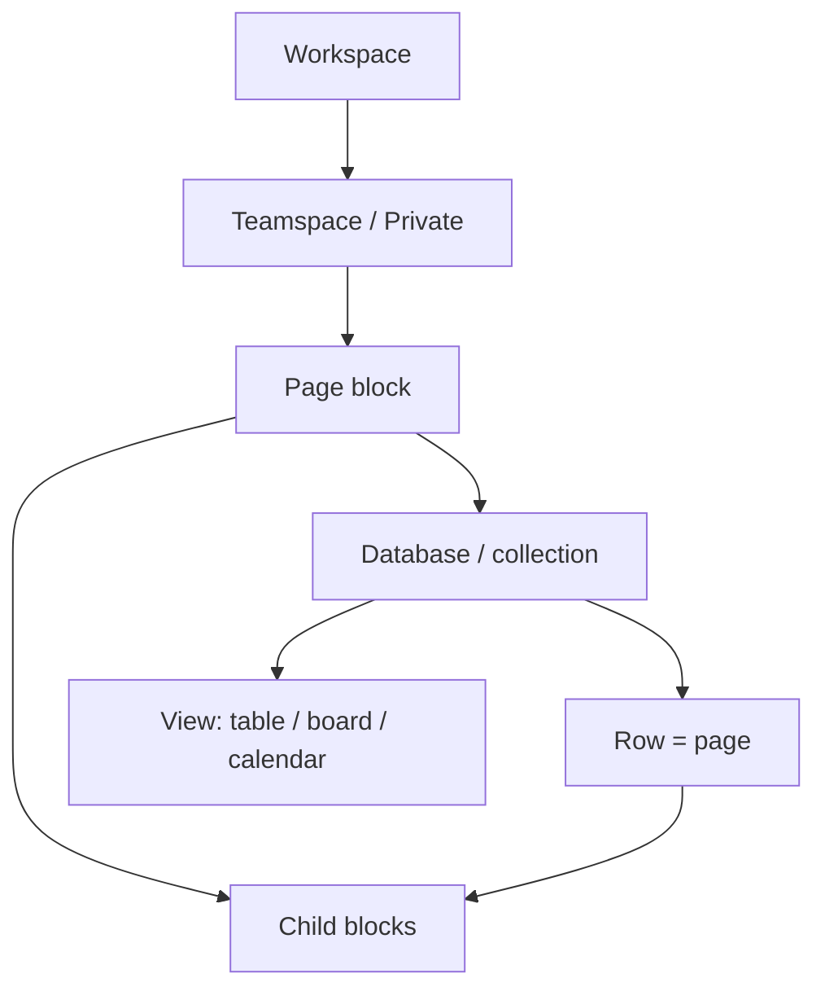

### Canonical block shape (conceptual)

```ts
type Block = {
  id: string;
  type: "paragraph" | "heading" | "database" | "image" | /* … */;
  parent_id: string | null;
  space_id: string;          // workspace shard key
  properties: Record<string, unknown>;
  content: string[];         // ordered child ids
  permissions?: Permission[];
  version: number;           // for sync / conflict resolution
};
```

**Design note:** The editor never “opens a file.” It mounts a root block and recursively hydrates children. That is why Notion feels like one continuous surface instead of Word-vs-Excel modes.

---

## 3. Client architecture

Clients are thin shells around a shared web application:

| Client | Shell | App core |
| --- | --- | --- |
| Web | Browser | React SPA |
| Desktop | Electron | Same React SPA |
| Mobile | Native wrappers / hybrid | Shared concepts, platform UI |

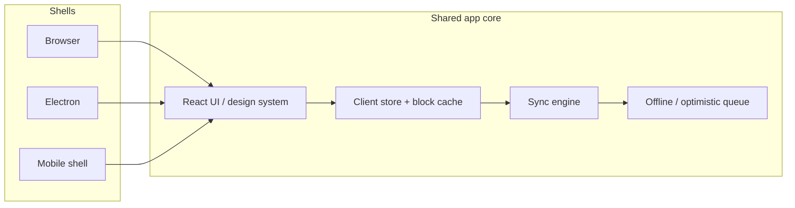

### Client layers (top → bottom)

1. **Presentation** — sidebar, topbar, editor canvas, database views, modals  
2. **Interaction** — selection, slash menu, drag-and-drop, keyboard maps  
3. **Document model** — block tree, transactions, undo/redo  
4. **Sync** — outbound mutations, inbound remote ops, presence  
5. **Platform** — IndexedDB/local cache, file uploads, notifications  

**Design note:** Latency budget for typing is ~16ms perceived. Remote round-trips must never sit on the keystroke path — hence optimistic local apply, then reconcile.

---

## 4. Collaboration & sync

Notion’s multiplayer story is “local-first feel, server-authoritative truth.”

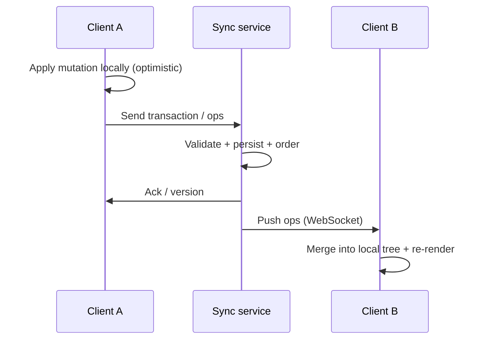

### Sync responsibilities

| Concern | Approach (conceptual) |
| --- | --- |
| Concurrent edits | Operational transforms / CRDT-like merge on structured ops |
| Ordering | Server-assigned versions per space/page |
| Presence | Ephemeral channel (cursors, “viewing”) — not durable |
| Offline | Queue mutations; replay on reconnect with conflict policy |
| Large pages | Partial load + lazy children; virtualized rendering |

---

## 5. Backend service map

At company scale, Notion decomposes into a **gateway + domain services + async workers**, sharded primarily by workspace (`space_id`).

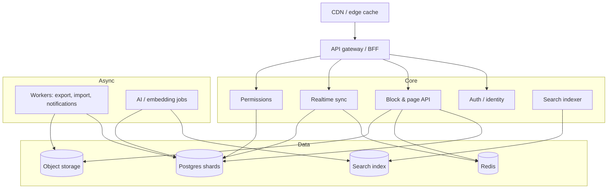

### Service catalog

| Service | Owns | Hot path? |
| --- | --- | --- |
| Auth / identity | Sessions, SSO, SCIM | Yes (edge-cached tokens) |
| Block API | CRUD, tree moves, properties | Yes |
| Sync / realtime | WebSocket fanout, presence | Yes |
| Permissions | ACL evaluation, share links | Yes (must be fast & correct) |
| Search | Full-text + semantic | Near-real-time async |
| File / media | Upload, CDN URLs, previews | Upload async |
| Notifications | Mentions, digests | Async |
| AI | Q&A, autofill, summaries | Async + streaming |
| Billing | Plans, seats, entitlements | Rare on editor path |

---

## 6. Data & storage model

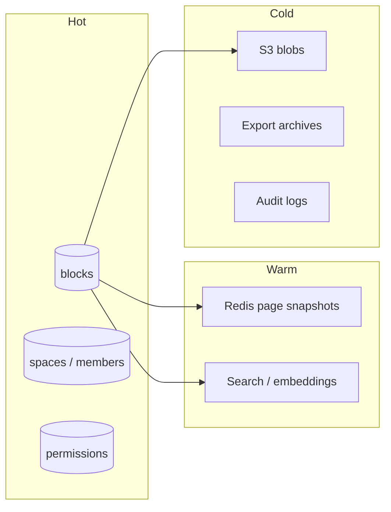

### Sharding intuition

- **Primary key for scale:** `space_id` (workspace).  
- Pages and blocks for a workspace stay co-located for locality.  
- Cross-workspace moves / public templates are special-case migrations.  
- File binaries live off-DB (object storage + CDN).

### Why not “one document blob”?

A single JSON blob per page fails at:

1. Concurrent multiplayer (whole-doc replace)  
2. Partial load of huge pages  
3. Database views that need property indexes  
4. Permission at subtree granularity  

Blocks + indexed properties are the cost of those features.

---

## 7. Permissions & sharing

Permissions flow **down the tree**, with explicit overrides and share links.

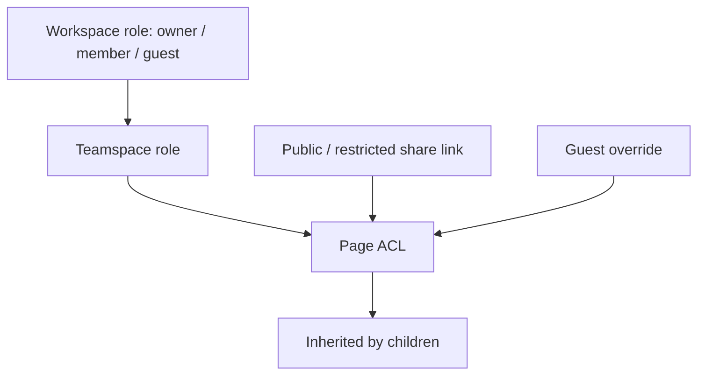

**Engineering rule:** Every read/write path evaluates effective permission for `(user, block)`. Cache aggressively; invalidate on ACL or parent moves.

**Design rule:** Sharing UI must answer one question: “Who can see this, and why?” Inheritance makes that hard — surface the source of access, not just the boolean.

---

## 8. Databases as a product surface (not a separate app)

Notion databases are **collections of pages** with typed properties + named views.

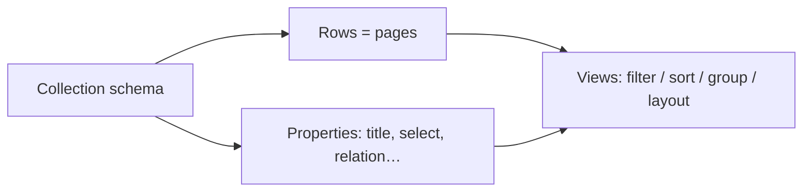

| View | Layout job | Data need |
| --- | --- | --- |
| Table | Dense scanning | Columnar property fetch |
| Board | Status workflow | Group-by + card preview |
| Calendar | Time planning | Date index |
| Timeline | Ranges | Start/end properties |
| Gallery | Visual browse | Cover images |

Same rows, different projectors — that is the architecture win designers feel as “one database, many views.”

---

## 9. Search & AI placement

Search and AI sit **beside** the editor, not inside the block transaction path.

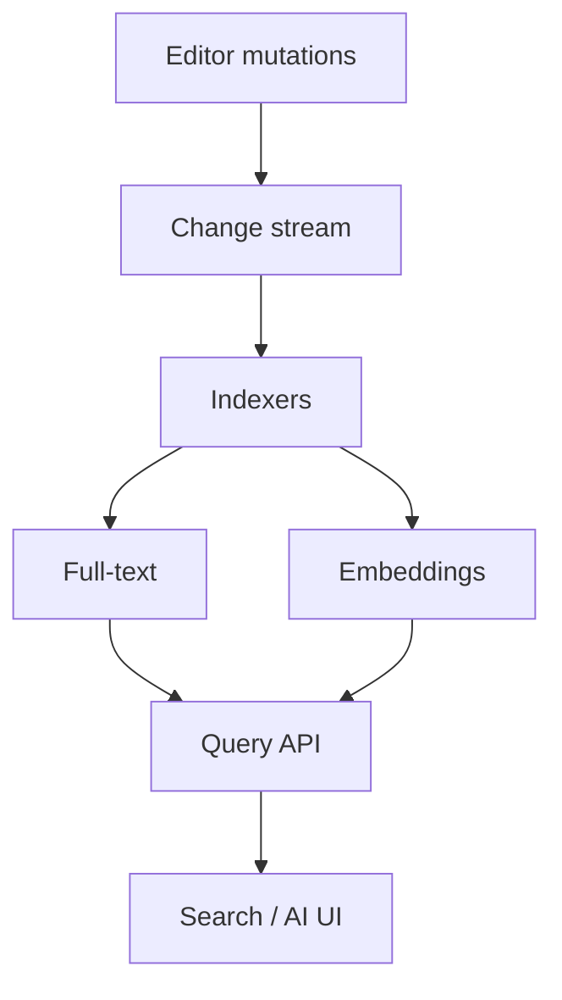

- **Indexing lag** is acceptable (seconds); **permission filtering** is not optional.  
- AI answers must be grounded in ACL-visible blocks only.  
- Streaming responses reuse the same auth context as the page.

---

## 10. UX architecture (designer lens)

### Spatial model

| Region | Job | Frequency |
| --- | --- | --- |
| Left sidebar | Navigate & orient | Constant |
| Top bar | Page chrome, share, favorite | Frequent |
| Center canvas | Create & read | Primary |
| Right panel | Comments / details / AI | Contextual |
| Slash / selection menus | Transform blocks | Burst |

### Interaction hierarchy

1. **Type** — zero chrome, caret is the UI  
2. **Slash** — intentional structure (`/table`, `/ai`)  
3. **Block handle** — rearrange, turn into, delete  
4. **Selection toolbar** — format & ask AI  
5. **Page menu** — rare: export, lock, connections  

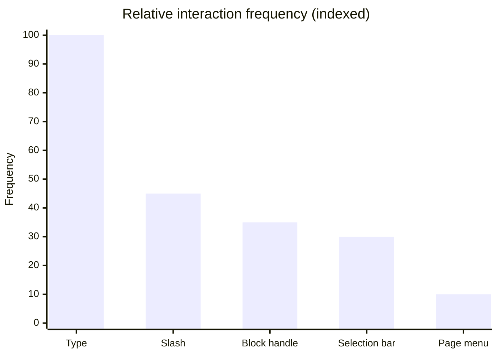

### Motion & feedback

- Optimistic insert/delete with soft layout animation  
- Presence cursors as ephemeral layers (never compete with content)  
- Loading: skeleton for distant pages; never blank the active page  

---

## 11. Cross-cutting quality bars

| Domain | Target behavior |
| --- | --- |
| Performance | First paint for a warm page under ~1s; typing never janks |
| Reliability | Sync reconnects without data loss; queue is durable client-side |
| Security | ACL on every fetch; public links are first-class threat model |
| Privacy | Workspace isolation; guest least-privilege |
| Observability | Trace `space_id` + `block_id` across API → DB → WS |
| Internationalization | RTL, CJK IME, locale-aware dates in databases |

---

## 12. End-to-end request paths

### A. Keystroke in a shared page

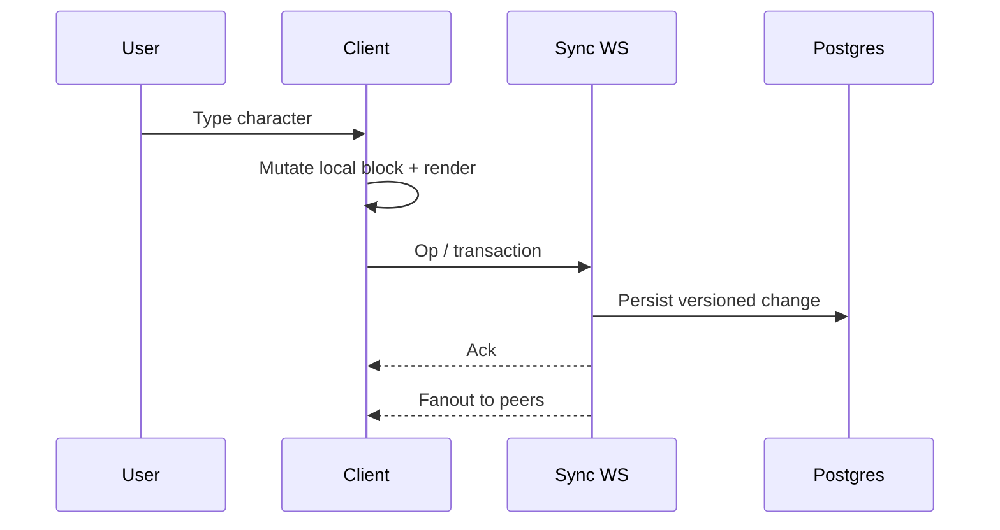

### B. Open a database board view

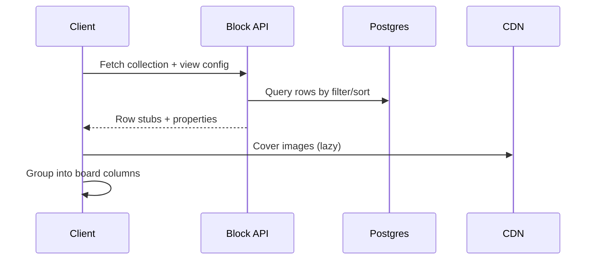

### C. Ask AI about a page

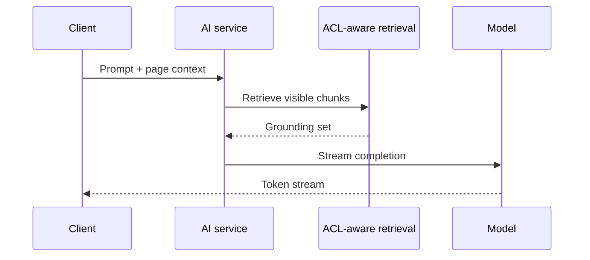

---

## 13. Suggested mental diagram for onboarding engineers

If you remember only one picture:

> **Clients hold a live block tree → mutations go through a sync plane → durable truth lives in sharded Postgres → search/AI/files are derived systems → permissions wrap every read.**

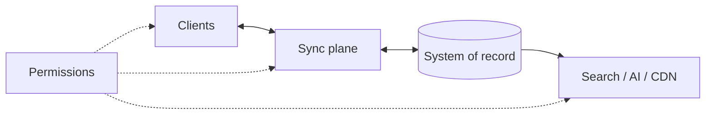

---

## 14. What this architecture enables (and costs)

**Enables**

- One product that is docs + wiki + project tracker  
- Deep linking and embeddable subtrees  
- Fine-grained sharing  
- Real-time collaboration without “checkout”  

**Costs**

- Complex client (editor + DB views + sync)  
- Permission evaluation on hot paths  
- Hard multiplayer edge cases (moves, merges, offline)  
- Operational burden of workspace sharding and migrations  

That tradeoff is intentional: Notion chose a **unified substrate** over a suite of simpler apps.

---

## References (public)

- Notion engineering blog posts on data model, scaling, and infrastructure  
- Conference talks on Notion’s block model and realtime collaboration  
- Observed product behavior across web / desktop / mobile  

*This document is an architectural reading suitable for product and engineering onboarding — not a claim of Notion’s private implementation details.*
